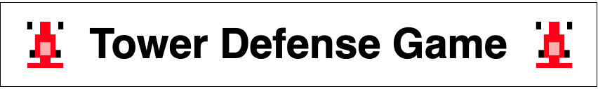
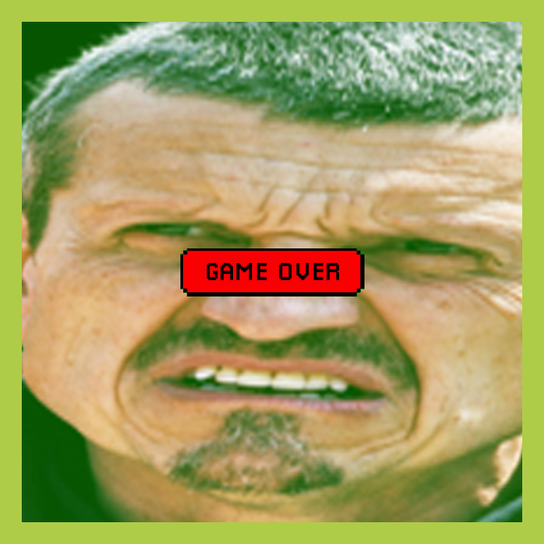
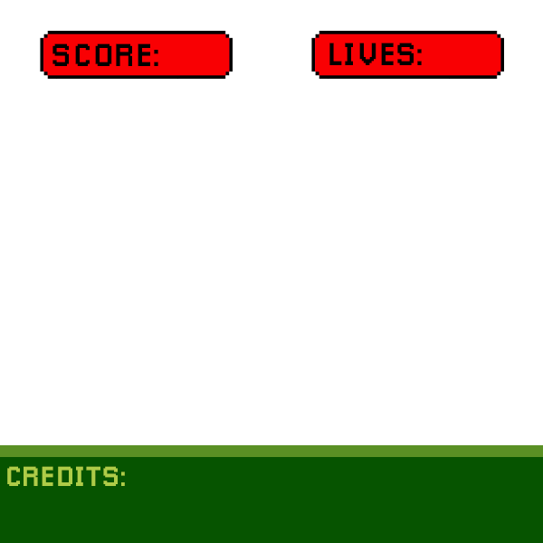
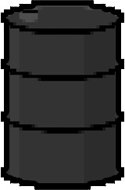
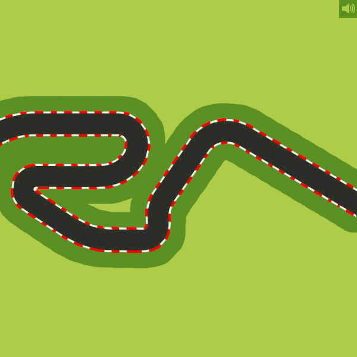
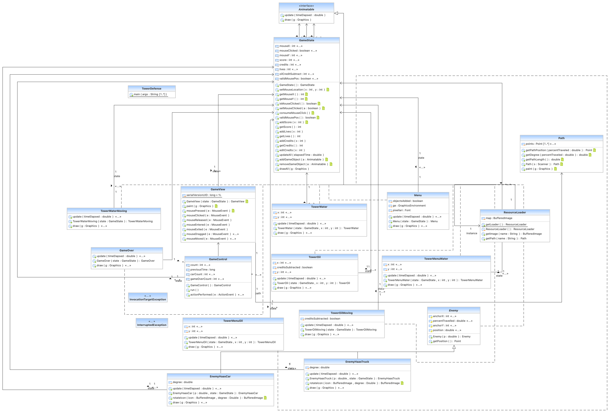
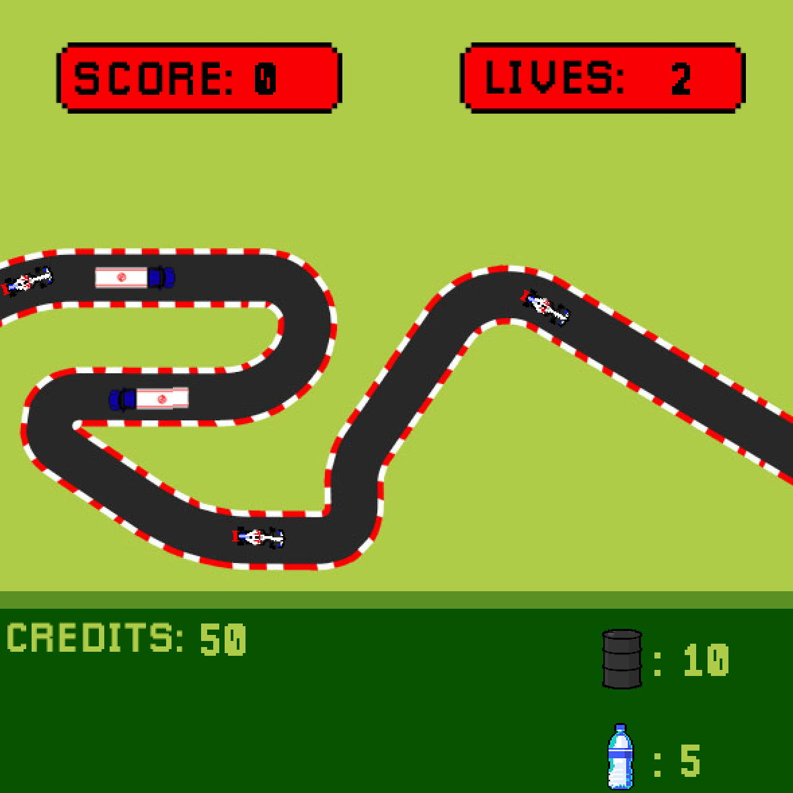

<h1 align="center">College Programming Portfolio</h1>
<h2 align="center">By Ethan Bowles</h2>

___
___
# Java:

  

___
>## About This Project
#### This Formula One inspired tower defense game is one of my first attempts at a game. One of the most important things for my partener and I was to make the graphics look good and add basic animation. After figuring out the path system we added cars and made them turn as they moved down the path to simulate actual movement. We added towers and basic gameplay rules. This project developed my overall programming skills. One of the most important things I learned from this project was how to implement separation of concerns and programming concepts such as encapculation and inheritance. 

>## Current Version - 1.1
>

>## Diagrams and Resources
>

>
Resources

>  
>>

>>
GameOver.png

>>
>>  &nbsp;&nbsp;&nbsp;&nbsp;&nbsp;&nbsp; 
>>  
>>

>>

>>
HaasCar.png

>>
>>  &nbsp;&nbsp;&nbsp;&nbsp;&nbsp;&nbsp; 
>>  
>>

>>

>>
HaasTruck.png

>>
>>  &nbsp;&nbsp;&nbsp;&nbsp;&nbsp;&nbsp; 
>>  
>>

>>

>>
MenuOverlay.png

>>
>>  &nbsp;&nbsp;&nbsp;&nbsp;&nbsp;&nbsp; 
>>  
>>

>>

>>
OilBarrel.png

>>
>>  &nbsp;&nbsp;&nbsp;&nbsp;&nbsp;&nbsp; 
>>  
>>

>>

>>
path_2.png

>>
>>  &nbsp;&nbsp;&nbsp;&nbsp;&nbsp;&nbsp; 
>>  
>>

>>

>>
WaterBottle.png

>>
>>  &nbsp;&nbsp;&nbsp;&nbsp;&nbsp;&nbsp; 
>>  
>>

>
>  [View All Resources](TowerDefense/TowerDefense/resources) 
>
>

>

>
Diagrams

>  
>>

>>
UML Diagram

>>
>>  &nbsp;&nbsp;&nbsp;&nbsp;&nbsp;&nbsp; 
>>  
>>

> 
>

>

>
Screenshots

>
>>

>>
Game Screen

>>
>>  &nbsp;&nbsp;&nbsp;&nbsp;&nbsp;&nbsp; 
>>  
>>

>>

>>
End Game Screen

>>
>>  &nbsp;&nbsp;&nbsp;&nbsp;&nbsp;&nbsp; 
>>  
>>

> 
>

>## Code
>

>
Source Code

>  
>  - [Animatable.java](TowerDefense/src/Animatable.java)
>  - [Enemy.java](TowerDefense/src/Enemy.java)
>  - [EnemyHaasCar.java](TowerDefense/src/EnemyHaasCar.java)
>  - [EnemyHaasTruck.java](TowerDefense/src/EnemyHaasTruck.java)
>  - [GameControl.java](TowerDefense/src/GameControl.java)
>  - [GameOver.java](TowerDefense/src/GameOver.java)
>  - [GameState.java](TowerDefense/src/GameState.java)
>  - [GameView.java](TowerDefense/src/GameView.java)
>  - [Menu.java](TowerDefense/src/Menu.java)
>  - [Path.java](TowerDefense/src/Path.java)
>  - [ResourceLoader.java](TowerDefense/src/ResourceLoader.java)
>  - [TowerDefense.java](TowerDefense/src/TowerDefense.java)
>  - [TowerMenuOil.java](TowerDefense/src/TowerMenuOil.java)
>  - [TowerMenuWater.java](TowerDefense/src/TowerMenuWater.java) 
>  - [TowerOil.java](TowerDefense/src/TowerOil.java)
>  - [TowerOilMoving.java](TowerDefense/src/TowerOilMoving.java)
>  - [TowerWater.java](TowerDefense/src/TowerWater.java)
>  - [TowerWaterMoving.java](TowerDefense/src/TowerWaterMoving.java) 
>
>  [View All Code](TowerDefense/src) 
>  
>

