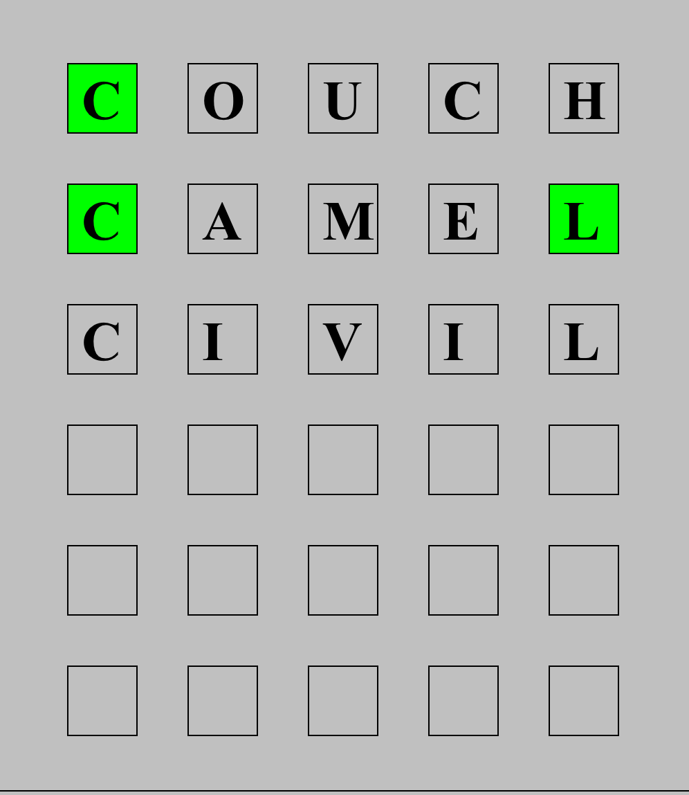
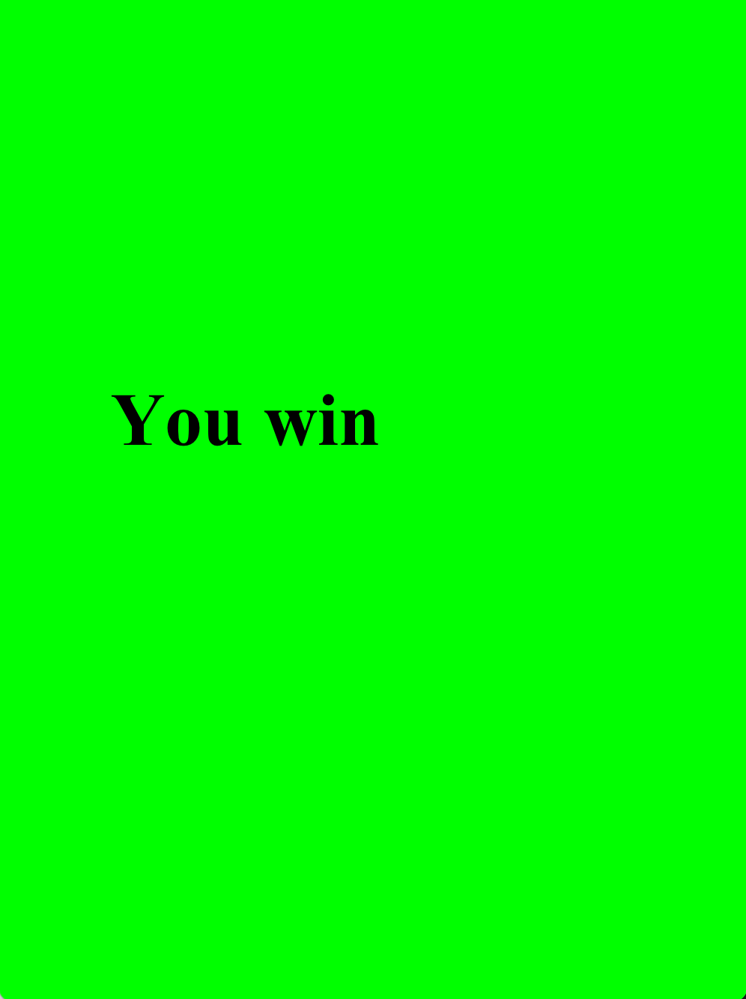

<h1 align="center">College Programming Portfolio</h1>
<h2 align="center">By Ethan Bowles</h2>

___
___

# Tower Defense Game

>## About This Project
#### This Formula One inspired tower defense game is one of my first attempts at a game. One of the most important things for my partner and I was to make the graphics look good and add basic animation. After figuring out the path system we added cars and made them turn as they moved down the path to simulate actual movement. We added towers and basic gameplay rules. This project developed my overall programming skills. One of the most important things I learned from this project was how to implement separation of concerns and programming concepts such as encapsulation and inheritance.

>## Diagrams and Resources
>

>
Resources

>  
>>

>>
GameOver.png

>>
>>  &nbsp;&nbsp;&nbsp;&nbsp;&nbsp;&nbsp; 
>>  
>>

>>

>>
HaasCar.png

>>
>>  &nbsp;&nbsp;&nbsp;&nbsp;&nbsp;&nbsp; 
>>  
>>

>>

>>
HaasTruck.png

>>
>>  &nbsp;&nbsp;&nbsp;&nbsp;&nbsp;&nbsp; 
>>  
>>

>>

>>
MenuOverlay.png

>>
>>  &nbsp;&nbsp;&nbsp;&nbsp;&nbsp;&nbsp; 
>>  
>>

>>

>>
OilBarrel.png

>>
>>  &nbsp;&nbsp;&nbsp;&nbsp;&nbsp;&nbsp; 
>>  
>>

>>

>>
path_2.png

>>
>>  &nbsp;&nbsp;&nbsp;&nbsp;&nbsp;&nbsp; 
>>  
>>

>>

>>
WaterBottle.png

>>
>>  &nbsp;&nbsp;&nbsp;&nbsp;&nbsp;&nbsp; 
>>  
>>

>
>  [View All Resources](TowerDefense/TowerDefense/resources) 
>
>

>

>
Diagrams

>  
>>

>>
UML Diagram

>>
>>  &nbsp;&nbsp;&nbsp;&nbsp;&nbsp;&nbsp; 
>>  
>>

> 
>

>

>
Screenshots

>
>>

>>
Game Screen

>>
>>  &nbsp;&nbsp;&nbsp;&nbsp;&nbsp;&nbsp; 
>>  
>>

>>

>>
End Game Screen

>>
>>  &nbsp;&nbsp;&nbsp;&nbsp;&nbsp;&nbsp; 
>>  
>>

> 
>

>## Code
>

>
Source Code

>  
>  - [Animatable.java](TowerDefense/src/Animatable.java)
>  - [Enemy.java](TowerDefense/src/Enemy.java)
>  - [EnemyHaasCar.java](TowerDefense/src/EnemyHaasCar.java)
>  - [EnemyHaasTruck.java](TowerDefense/src/EnemyHaasTruck.java)
>  - [GameControl.java](TowerDefense/src/GameControl.java)
>  - [GameOver.java](TowerDefense/src/GameOver.java)
>  - [GameState.java](TowerDefense/src/GameState.java)
>  - [GameView.java](TowerDefense/src/GameView.java)
>  - [Menu.java](TowerDefense/src/Menu.java)
>  - [Path.java](TowerDefense/src/Path.java)
>  - [ResourceLoader.java](TowerDefense/src/ResourceLoader.java)
>  - [TowerDefense.java](TowerDefense/src/TowerDefense.java)
>  - [TowerMenuOil.java](TowerDefense/src/TowerMenuOil.java)
>  - [TowerMenuWater.java](TowerDefense/src/TowerMenuWater.java) 
>  - [TowerOil.java](TowerDefense/src/TowerOil.java)
>  - [TowerOilMoving.java](TowerDefense/src/TowerOilMoving.java)
>  - [TowerWater.java](TowerDefense/src/TowerWater.java)
>  - [TowerWaterMoving.java](TowerDefense/src/TowerWaterMoving.java) 
>
>  [View All Code](TowerDefense/src) 
>  
>

___

# Wordle
>## About This Project
#### This project is a copy of the well known game Wordle. You are given 5 guesses to choose the correct word. In this application there is a list of around 10,000 words in the game. These are read through a text file and stored in the game. If a correct letter is guessed in the right location, the square turns green. If a correct letter guessed in the wrong location, the square turns yellow. If an incorrect letter is guessed, the square remains the same color. Background music was added to this project

>## Diagrams and Resources
>

>
Resources

>  
>>

>>
WordleGamePic.png

>>
>>  &nbsp;&nbsp;&nbsp;&nbsp;&nbsp;&nbsp; 
>>  
>>

>>

>>
WordleWinScreen.png

>>
>>  &nbsp;&nbsp;&nbsp;&nbsp;&nbsp;&nbsp; 
>>  
>>

>> 
>> [Answers.txt](wordle/Answers.txt) 
>
>

>## Code
>

>
Source Code

>  
>  - [Box.java](wordle/Box.java) 
>  - [MusicPlayer.java](wordle/MusicPlayer.java) 
>  - [Wordle.java](wordle/Wordle.java) 
>  - [WordlePanel.java](wordle/WordlePanel.java) 
>
>  [View All Code](wordle) 
>  
>

___

# Grammar Maker
>## About This Project
#### This program constructs a certain number of random sentences from a .g grammar file. It recursively reads the .g files and constructs sentences by jumping to instructions that are located in <>.

>## Diagrams and Resources
>

>
Resources

>  
>> [poetic_sentence.g](grammarProject/poetic_sentence.g) 
>
>

>## Code
>

>
Source Code

>  
>  - [FileReader.java](grammarProject/FileReader.java) 
>  - [RandomPhraseGenerator.java](grammarProject/RandomPhraseGenerator.java) 
>
>  [View All Code](grammarProject) 
>  
>

___

# Websites
>## About This Project
#### Personal website used to showcase my programming projects and learn how to code HTML, CSS, and JS. Tried to implement a couple JS animation scripts.
[ethanpbowles](https://ethanpbowles.com)
#### Website for cousins lawncare buisness. Contains welcome page, services and a contact page. 
[snidermowing](https://snidermowing.com/)

>## Personal Website Code
>

>
Source Code

>  
>  - [index.html](Website/index.html) 
>  - [style.css](Website/style.css) 
>  - [scripts.js](Website/Scripts/myscripts.js) 
>
>  [View All Code](Website) 
>  
>

>## Lawncare Website Code
>

>
Source Code

>  
>  - [index.html](RyansWebsite/index.html) 
>  - [style.css](RyansWebsite/style.css) 
>  - [scripts.js](RyansWebsite/Scripts/myscripts.js) 
>
>  [View All Code](RyansWebsite) 
>  
>

___

# C++ Projects
>[C++ Projects](C++_Projects)

# More Projects
>[View More Projects](https://github.com/ethanbowles03/WebsitePortfolio) 
