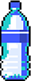

<h1 align="center">College Programming Portfolio</h1>
<h2 align="center">By Ethan Bowles</h2>

___
___
# Year 1:

  

___
>## About This Project
#### This Formula One inspired tower defense game is one of my first attempts at a game. One of the most important things for my partener and I was to make the graphics look good and add basic animation. After figuring out the path system we added cars and made them turn as they moved down the path to simulate actual movement. We added towers and basic gameplay rules. This project developed my overall programming skills. One of the most important things I learned from this project was how to implement separation of concerns and programming concepts such as encapculation and inheritance. 

>## Current Version - 1.1

>## Diagrams and Resources
>

>
Resources

>  
>>

>>
GameOver.png

>>
>>  &nbsp;&nbsp;&nbsp;&nbsp;&nbsp;&nbsp; 
>>  
>>

>>

>>
HaasCar.png

>>
>>  &nbsp;&nbsp;&nbsp;&nbsp;&nbsp;&nbsp; 
>>  
>>

>>

>>
HaasTruck.png

>>
>>  &nbsp;&nbsp;&nbsp;&nbsp;&nbsp;&nbsp; 
>>  
>>

>>

>>
MenuOverlay.png

>>
>>  &nbsp;&nbsp;&nbsp;&nbsp;&nbsp;&nbsp; 
>>  
>>

>>

>>
OilBarrel.png

>>
>>  &nbsp;&nbsp;&nbsp;&nbsp;&nbsp;&nbsp; 
>>  
>>

>>

>>
path_2.png

>>
>>  &nbsp;&nbsp;&nbsp;&nbsp;&nbsp;&nbsp; 
>>  
>>

>>

>>
WaterBottle.png

>>
>>  &nbsp;&nbsp;&nbsp;&nbsp;&nbsp;&nbsp; 
>>  
>>

>
>  [View All Resources](TowerDefense/TowerDefense/resources) 
>
>

>

>
Diagrams

>  
>>

>>
UML Diagram

>>
>>  &nbsp;&nbsp;&nbsp;&nbsp;&nbsp;&nbsp; 
>>  
>>

> 
>

>

>
Screenshots

>
>>

>>
Game Screen

>>
>>  &nbsp;&nbsp;&nbsp;&nbsp;&nbsp;&nbsp; 
>>  
>>

>>

>>
End Game Screen

>>
>>  &nbsp;&nbsp;&nbsp;&nbsp;&nbsp;&nbsp; 
>>  
>>

> 
>

>## Code
>

>
Source Code

>  
>  - [Animatable.java](TowerDefense/src/Animatable.java)
>  - [Enemy.java](TowerDefense/src/Enemy.java)
>  - [EnemyHaasCar.java](TowerDefense/src/EnemyHaasCar.java)
>  - [EnemyHaasTruck.java](TowerDefense/src/EnemyHaasTruck.java)
>  - [GameControl.java](TowerDefense/src/GameControl.java)
>  - [GameOver.java](TowerDefense/src/GameOver.java)
>  - [GameState.java](TowerDefense/src/GameState.java)
>  - [GameView.java](TowerDefense/src/GameView.java)
>  - [Menu.java](TowerDefense/src/Menu.java)
>  - [Path.java](TowerDefense/src/Path.java)
>  - [ResourceLoader.java](TowerDefense/src/ResourceLoader.java)
>  - [TowerDefense.java](TowerDefense/src/TowerDefense.java)
>  - [TowerMenuOil.java](TowerDefense/src/TowerMenuOil.java)
>  - [TowerMenuWater.java](TowerDefense/src/TowerMenuWater.java) 
>  - [TowerOil.java](TowerDefense/src/TowerOil.java)
>  - [TowerOilMoving.java](TowerDefense/src/TowerOilMoving.java)
>  - [TowerWater.java](TowerDefense/src/TowerWater.java)
>  - [TowerWaterMoving.java](TowerDefense/src/TowerWaterMoving.java) 
>
>  [View All Code](TowerDefense/src) 
>  
>

___

# Wordle
>## About This Project
#### This project is a copy of the well known game wordle. You are given 5 guesses to to choose the correct word. In this application there is a list of around 10000 words in the game. These are read through a text file and stored in the game. If a correct letter is guess in the right location the square turns green, if in the wrong location turns yellow, and a wrong guess the square remains the same color. Background music was added to this project. 

>## Current Version - 1.1

>## Diagrams and Resources
>

>
Resources

>  
>>

>>
WordleGamePic.png

>>
>>  &nbsp;&nbsp;&nbsp;&nbsp;&nbsp;&nbsp; 
>>  
>>

>>

>>
WordleWinScreen.png

>>
>>  &nbsp;&nbsp;&nbsp;&nbsp;&nbsp;&nbsp; 
>>  
>>

>> 
>> [Answers.txt](wordle/Answers.txt) 
>
>

>## Code
>

>
Source Code

>  
>  - [Box.java](wordle/Box.java) 
>  - [MusicPlayer.java](wordle/MusicPlayer.java) 
>  - [Wordle.java](wordle/Wordle.java) 
>  - [WordlePanel.java](wordle/WordlePanel.java) 
>
>  [View All Code](wordle) 
>  
>

___

# Grammar Maker
>## About This Project
#### This program consructs a certain number of random sentences from a .g grammar file. It recursively reads the .g files and constructs sentences by jumping to instructions that are located in <>.

>## Current Version - 1.1

>## Diagrams and Resources
>

>
Resources

>  
>> [poetic_sentence.g](grammarProject/poetic_sentence.g) 
>
>

>## Code
>

>
Source Code

>  
>  - [FileReader.java](grammarProject/FileReader.java) 
>  - [RandomPhraseGenerator.java](grammarProject/RandomPhraseGenerator.java) 
>
>  [View All Code](grammarProject) 
>  
>

# Year 2:
___

# Spreadsheet Application
>## About This Project
#### A spreadsheet application which allows the user to create a new spreadsheet, open an existing one, or save the current one to a file. The user can use cells and variables (if the variables have a value) of format A1 through Z99 to store specific formulas or values and create desired calculations. Implements copy and paste functions and cell chaining for a complete spreadsheet experience. 

>## Current Version - 1.1

>## Diagrams and Resources
>

>
Resources

>  
>>

>>
SpreadsheetPic1.png

>>
>>  &nbsp;&nbsp;&nbsp;&nbsp;&nbsp;&nbsp; 
>>  
>>

>> 
>> [README W More Details](spreadsheetApp/README.md) 
>
>

>## Code
>

>
Source Code

>  
>  - [DependencyGraph.cs](spreadsheetApp/spreadsheet/DependencyGraph.cs) 
>  - [Formula.cs](spreadsheetApp/spreadsheet/Formula.cs) 
>  - [Spreadsheet.cs](spreadsheetApp/spreadsheet//Spreadsheet.cs) 
>  - [MAUI](spreadsheetApp/MAUI%Program) 
>
>  [View All Code](spreadsheetApp) 
>  
>

___

# Snake Game
>## About This Project
#### Fully multiplayer snake game that allows multiple players connect. Uses a TCP socket handshake to establish connection between the server and the client. The server handles the computation of snake, wall, and powerup locations, along with game collisions, physics and score keeping. The client code connects to the server and displays all information sent by the server on the screen of the player. The server has no limit on client connections. The goal of the game is to grow your snake as long as possible while avoiding walls and other players. 

>## Current Version - 1.1

>## Diagrams and Resources
>

>
Resources

>  
>>

>>
InGame.png

>>
>>  &nbsp;&nbsp;&nbsp;&nbsp;&nbsp;&nbsp; 
>>  
>>

>>

>>
Client.png

>>
>>  &nbsp;&nbsp;&nbsp;&nbsp;&nbsp;&nbsp; 
>>  
>>

>>

>>
Server.png

>>
>>  &nbsp;&nbsp;&nbsp;&nbsp;&nbsp;&nbsp; 
>>  
>>

>> 
>> [README W More Details](SnakeGame/README.md) 
>
>

>## Code
>

>
Source Code

>  
>  - [Model](SnakeGame/Model) 
>  - [Server](SnakeGame/Server) 
>  - [ServerController](SnakeGame/ServerController) 
>  - [SnakeClient](SnakeGame/SnakeClient) 
>  - [Vector2D](SnakeGame/Vector2D) 
>
>  [View All Code](SnakeGame) 
>  
>

